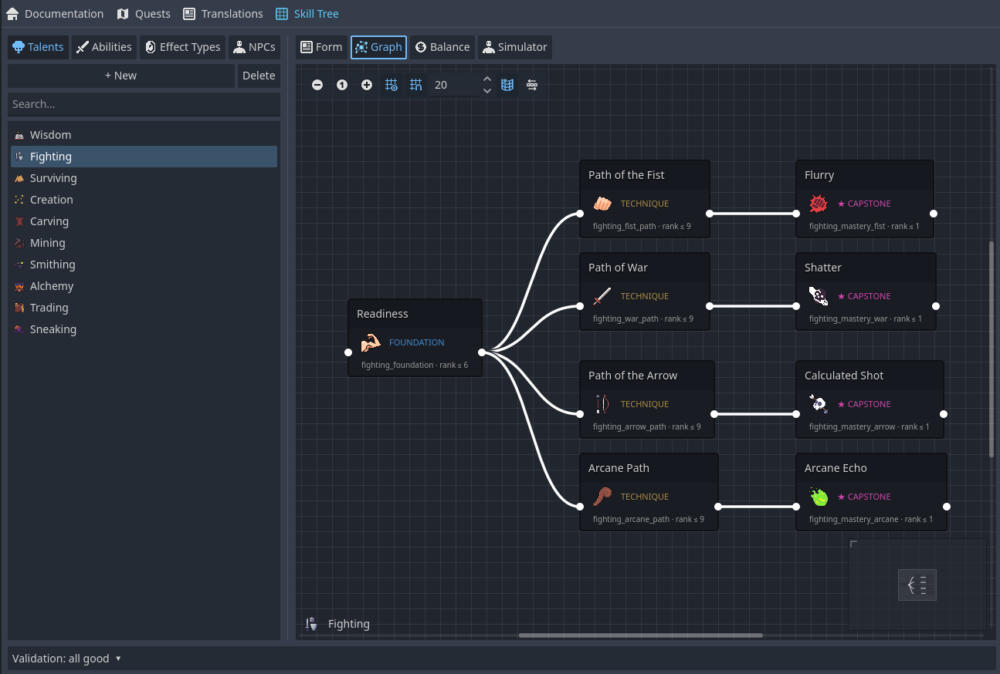
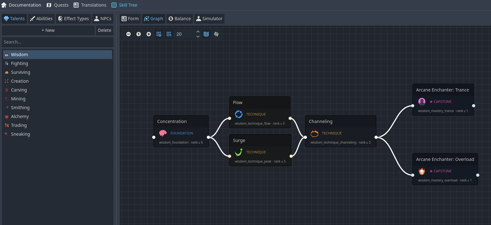
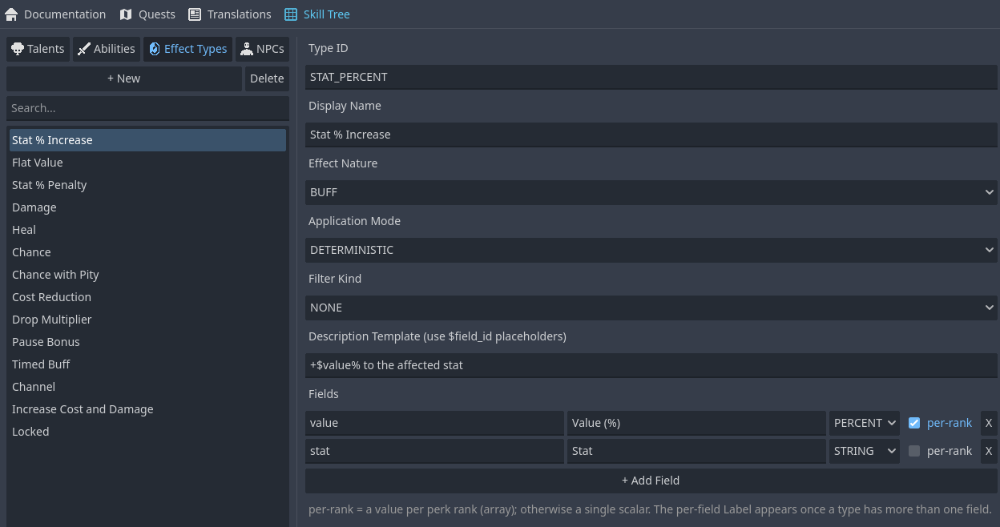
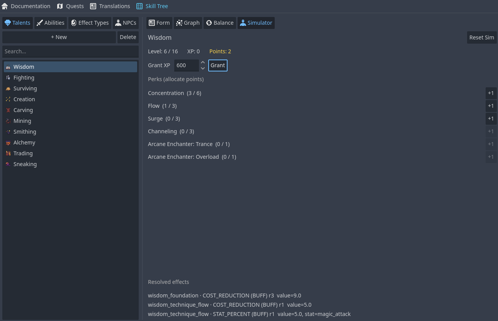
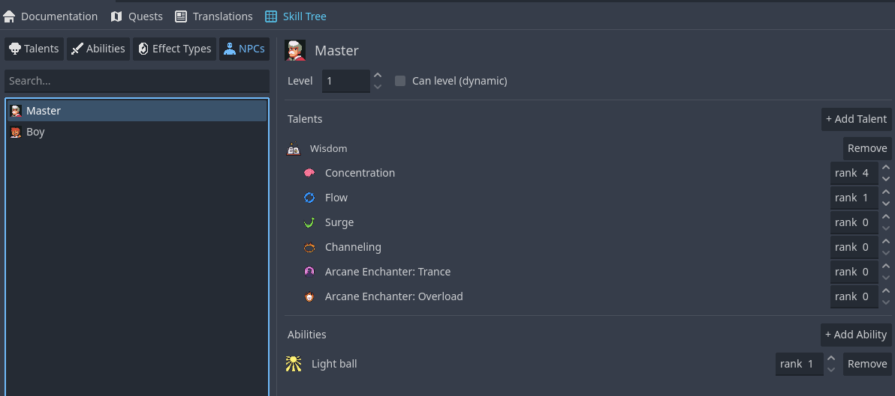

# 💎 Skill Tree Editor

A complete in-editor tool for authoring character progression — **Talents** (passive perk trees) and **Abilities** (active skills) — no code required. Design perk graphs, define reusable effects and conditions, validate your data, balance it, and simulate allocation, all from within Godot. You can also give **NPCs** their own talents and abilities.

**Availability:** 💎 Premium (v1.4.0+)

---

## Overview

The Skill Tree Editor lives inside the **Pandora+** main-screen tab and is organized into four sub-tabs:

- **Talents** — Passive perk trees: an XP curve, a max level, per-level perk points, and a graph of perks players unlock and rank up
- **Abilities** — Active skills: cost, cooldown, duration, usage-based leveling, and an optional parent Talent (dual-XP)
- **Effect Types** — Schema-driven, reusable effect definitions assigned to perks/abilities (e.g. *Damage*, *Heal*, *Stat %*)
- **NPCs** — Give NPCs a static loadout of talents/abilities (see [NPC Skills](/core-systems/skill-tree-editor?id=npc-skills))

> 💡 **Design principle — resolver, not applier.** Pandora+ owns the skill-tree *state* (XP, levels, perk points, allocation) and *resolves* effect values at the current rank. **Your game applies** those numbers in its own combat/crafting/gameplay logic. Pandora+ never applies an effect itself.

<!-- Screenshot: Skill Tree Editor with the Talents sub-tab selected, talent list on the left, form on the right -->


---

## Getting Started

1. Enable **Pandora+** in *Project Settings → Plugins*
2. Click the **Pandora+** tab in the main editor toolbar
3. Click **🌳 Skill Tree** in the navigation bar
4. Pick a sub-tab (**Talents**, **Abilities**, **Effect Types**, **NPCs**) and click **+ New**

Entities are named after the display name you set, so they read clearly in Pandora's own entity tree.

---

## Talents

A **Talent** is a passive perk tree. Its form lets you configure:

- **Name & description** and an optional **icon**
- **Base max level** and an **XP-per-level** curve (the XP needed to advance each level)
- **Perks** — the nodes of the tree (see below)
- **XP sources** — declarative rules that grant XP from in-game actions (e.g. *kill*, *craft*), with an optional target filter and a multiplier variable
- **Unlock conditions** — gate the whole talent behind [conditions](/core-systems/skill-tree-editor?id=conditions)

Each **level** grants one perk point (the player learns the talent at level 1). Players spend points to raise perk ranks.

### Perks

A **perk** is a node with:

- A **perk_id** (referenced by other perks' prerequisites)
- A **category** (Foundation / Technique / Capstone) and an optional **branch group** (to mark forks/"bivii")
- A **max rank**
- **Prerequisites** (other perk_ids that must be ranked first)
- **Effects** — one or more [Effect Types](/core-systems/skill-tree-editor?id=effect-types) with values per rank
- **Unlock conditions**

### Perk Graph

Switch the right-pane view to **Graph** to see a Talent's perk topology:

- Nodes are perks; edges are prerequisites
- **Drag** from one node's output to another's input to create a prerequisite; press **Delete** or use the context menu to remove
- Branch groups are tinted so forks read at a glance; perk icons are shown on the nodes
- **Auto-Layout All** arranges the tree (Sugiyama layered layout); circular dependencies are highlighted in red

<!-- Screenshot: Perk Graph view showing several perk nodes connected by prerequisite edges with branch tinting -->


---

## Abilities

An **Ability** is an active skill. Its form configures:

- **Name & description** and an optional **icon**
- **Cost** (type + per-level amounts), **cooldown**, **duration**
- **Usage-per-level** curve (level up by use) and a **max ability level**
- An optional **parent Talent** — using the ability can also grant the parent Talent XP (dual-XP)
- **Effects** and **unlock conditions**

> Timing values like cooldown/duration and "after N seconds" thresholds are **data** the game reads and applies — Pandora+ resolves the numbers, your game runs the timers.

---

## Effect Types

An **Effect Type** is a reusable, schema-driven effect definition. Instead of hard-coded effect kinds, you declare:

- A **type_id** (e.g. `DAMAGE`) and a **display name**
- **Fields** — your own parameters, each with a value kind (Float / Int / Percent / …) and a **per-rank** flag (an array of per-rank values) or a scalar
- An **effect nature** — Buff / Malus / Damage / Heal / Utility (routing metadata used by the Balance view)
- An **application mode** — Deterministic or Probabilistic

Assign Effect Types to a perk's (or ability's) effects and fill in the values; at runtime Pandora+ resolves them at the current rank.

**12 presets** are seeded automatically: Stat %, Flat Value, Stat Penalty, Damage, Heal, Chance, Chance-with-Pity, Cost Reduction, Drop Multiplier, plus timing presets **Pause Bonus**, **Timed Buff**, and **Channel**.

<!-- Screenshot: Effect Types sub-tab showing the field builder for a Damage effect -->


---

## Conditions

Conditions are reusable predicates used by **unlock_conditions** (on talents, perks, abilities). Supported types:

`TALENT_LEVEL`, `PERK_RANK`, `TREE_POINTS_SPENT`, `ABILITY_LEVEL`, `QUEST_COMPLETED`, `ITEM_OWNED`, `STAT_THRESHOLD`, `FLAG_SET`, `CUSTOM_EXPRESSION`.

Inventory/stat/flag/quest checks are answered by your game through a **state provider** (see [Runtime](/core-systems/skill-tree-editor?id=runtime)).

---

## Validation, Balance & Simulator

- **Validation Panel** (collapsible, spans the module bottom) — project-wide checks: missing IDs, broken prerequisite references, cycles, perks/abilities with unconfigured effects, conditions missing a target/compare value. Double-click an issue to navigate to it.
- **Balance View** (Talents) — effect distribution per Talent, grouped by effect nature, so you can spot lopsided trees.
- **Allocation Simulator** (Talents) — grant XP, spend points, and watch the runtime resolver compute effect values live, exactly as they would be in-game.

<!-- Screenshot: Allocation Simulator with a talent partially allocated and resolved effect values -->


---

## NPC Skills

NPCs — enemies **and** companions — can have talents and abilities, configured from the **NPCs** sub-tab.

- **Static loadout** — Select an NPC, then add Talents (and set a rank for each of their perks) and Abilities (with a rank). No JSON by hand. Icons set on talents, perks and abilities are shown next to them for quick recognition.
- **Level** — An optional character level (used for scaling/conditions/display).
- **Can level** — Off by default (fixed loadout). Turn it on for NPCs that should gain skill XP and level up at runtime.

<!-- Screenshot: NPCs sub-tab showing an NPC's loadout with talents, per-perk ranks, and abilities -->


---

## Runtime

The skill system is driven by the **`PPSkillTreeUtils`** autoload (the player) and **`PPSkillTreeState`** instances (per actor).

### Player

```gdscript
# Grant XP, allocate perks, read resolved effect values
PPSkillTreeUtils.grant_xp(talent_id, 100)
if PPSkillTreeUtils.can_allocate(talent_id, "p_damage"):
    PPSkillTreeUtils.allocate_perk_point(talent_id, "p_damage")

var dmg = PPSkillTreeUtils.get_effect_value(talent_id, "p_damage", "DAMAGE", "amount")
# ... your game applies `dmg` to its combat logic

# All active effects on a talent, for bulk application:
for e in PPSkillTreeUtils.get_resolved_effects(talent_id):
    print(e.effect_type, e.effect_nature, e.values)
```

Provide a **state provider** so condition checks that need per-player data work:

```gdscript
PPSkillTreeUtils.set_state_provider(my_provider)
# my_provider may implement: get_flag(name), get_var(name),
# get_item_count(item_id), get_stat(stat_id), get_quest_completed(quest_id)
```

Persist/restore with `save_state()` / `load_state(dict)`.

### NPCs

Each `PPRuntimeNPC` builds its own skill state from the entity's loadout on spawn:

```gdscript
# Resolved effects/abilities for an NPC:
for e in runtime_npc.get_skill_effects():
    apply_effect(e)                       # your game applies it
if runtime_npc.has_skill_ability(ability_id):
    use_ability(ability_id)

# Dynamic leveling (only if the NPC has can_level = true):
runtime_npc.grant_skill_xp(talent_id, 50)
```

The NPC's loadout and progression are serialized with the NPC's `to_dict()` / `from_dict()`.

---

*Complete Guide for Pandora+ v1.4.0-premium*
