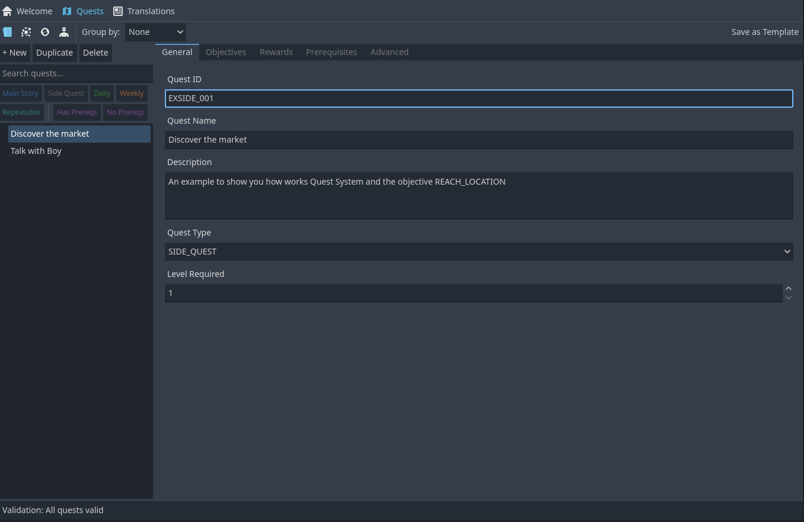
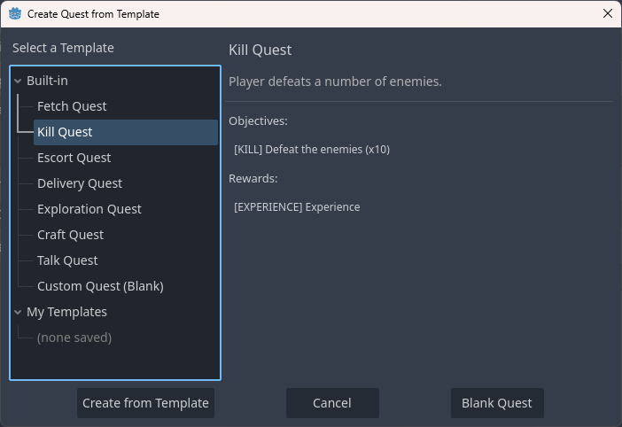
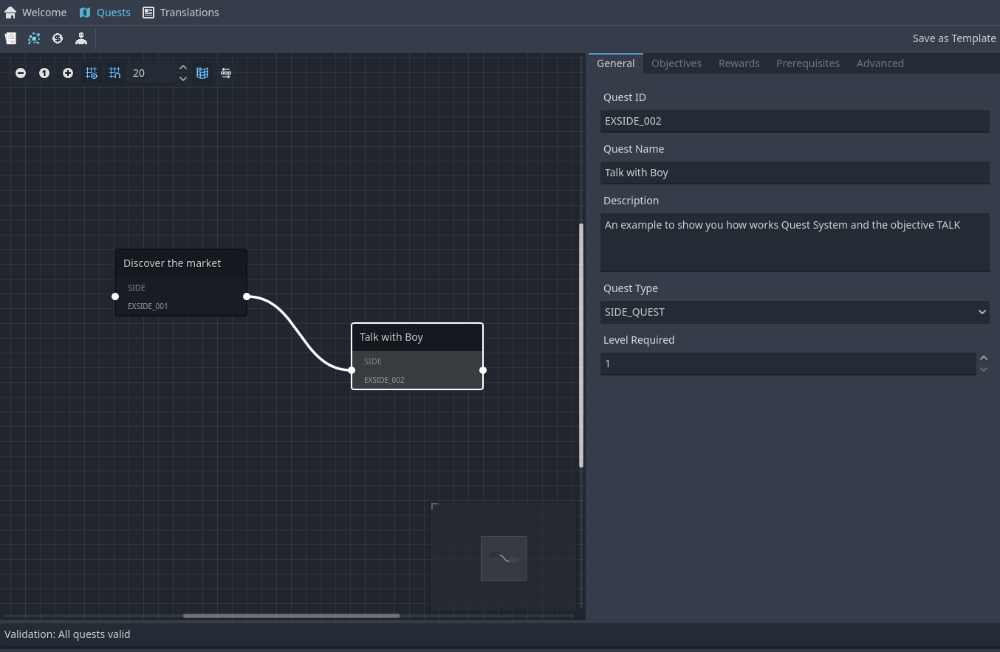
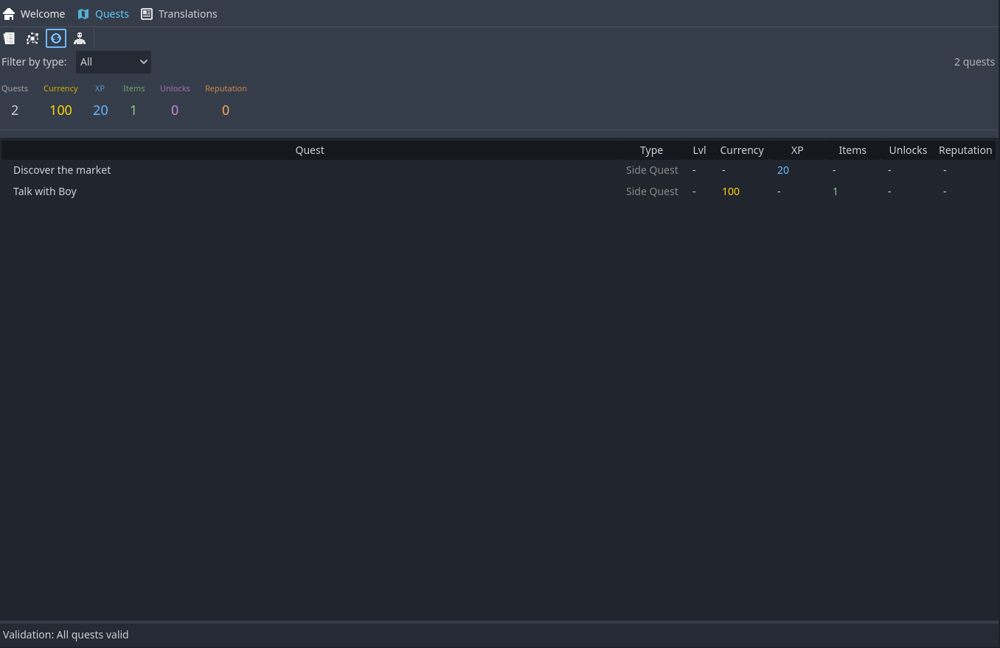
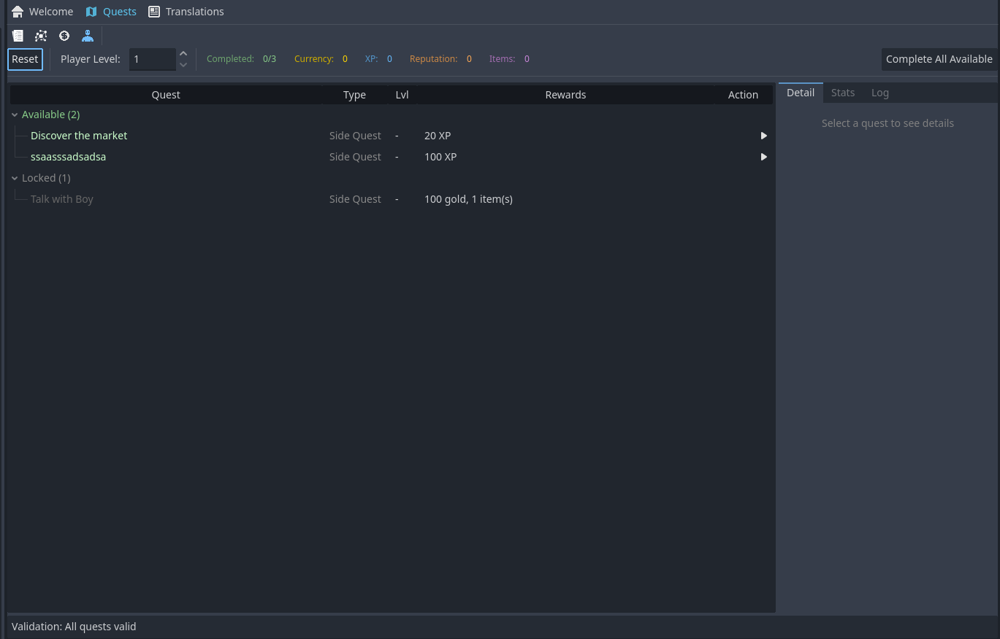
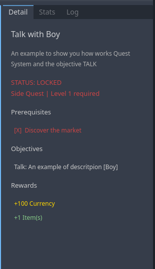
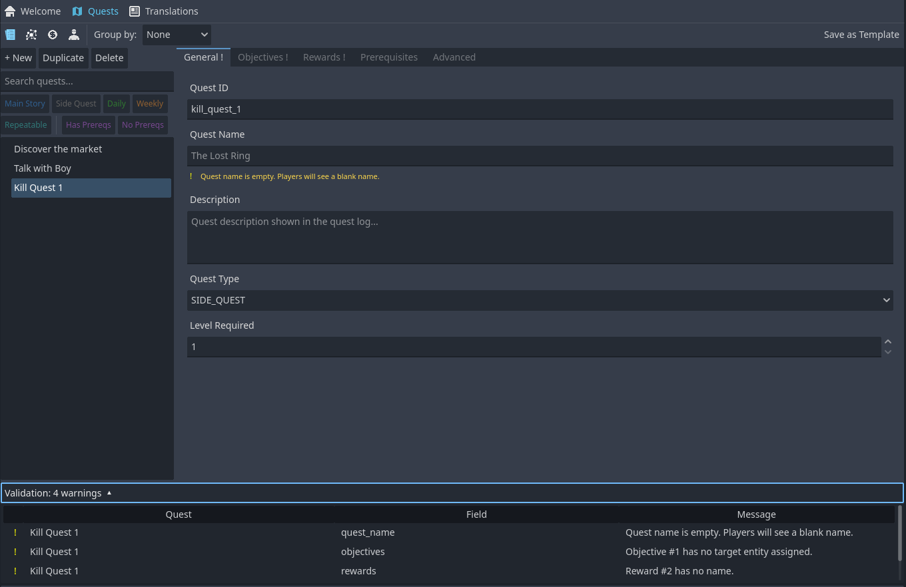

# 💎 Visual Quest Editor

A complete in-editor tool for authoring, visualizing, and testing quests — no code required. Design quest chains, validate data integrity, analyze reward balance, and simulate player progression all from within Godot.

**Availability:** 💎 Premium (v1.3.0+)

---

## Overview

The Visual Quest Editor replaces manual property editing in Pandora with a dedicated, purpose-built UI. It lives inside the **Pandora+** main-screen tab and provides four complementary views:

- **List View** — Browse, search, filter, and edit quests in a familiar list + form layout
- **Graph View** — Visualize prerequisite chains as a directed graph with auto-layout
- **Balance View** — Analyze reward distribution across quest types with charts and metrics
- **Simulator View** — Walk through quest progression as a virtual player with interactive objectives

**No GDScript required.** Everything from quest creation to template management happens through the editor UI.

<!-- Screenshot: Full editor with list view selected, showing the quest list on the left and the 5-tab form on the right -->

---

## Getting Started

### Opening the Editor

1. Enable **Pandora+** in Project Settings > Plugins
2. Click the **Pandora+** tab in the main editor toolbar
3. Click **Quests** in the navigation bar

### Creating Your First Quest

1. Click **+ New** in the quest list toolbar
2. The **Template Picker** opens — choose a preset (e.g., *Fetch Quest*, *Kill Quest*) or start from *Blank*
3. Fill in the **General** tab: Quest ID, name, description, type, and level requirement
4. Switch to the **Objectives** tab and click **+ Add** to create objectives
5. Add rewards in the **Rewards** tab
6. Data saves automatically to Pandora

<!-- Screenshot: Template picker dialog showing the 8 built-in presets with preview panel -->

---

## List View

The default view: a split layout with the quest list on the left and a 5-tab form editor on the right.

### Quest List Panel

- **Search** — Filter quests by name or ID in real time
- **Filter Chips** — Toggle filters by quest type (Main, Side, Daily, Weekly, Repeatable) and prerequisite status
- **Group By** — Group quests by type, level range, or flat list
- **Toolbar** — New (from template), Duplicate, Delete

### Form Editor (5 Tabs)

| Tab | Fields |
|-----|--------|
| **General** | Quest ID, Quest Name, Description, Quest Type, Level Requirement |
| **Objectives** | Reorderable list of objectives with popup editor |
| **Rewards** | Reorderable list of rewards with popup editor |
| **Prerequisites** | Quest dependency list with entity picker |
| **Advanced** | Time Limit, Category Tag, Auto-Complete toggle |

### Objective Types

Each objective type shows context-appropriate fields in its popup editor:

| Type | Target Entity | Quantity | Notes |
|------|--------------|----------|-------|
| **Collect** | Item | Yes | Gather X items |
| **Kill** | NPC | Yes | Defeat X enemies |
| **Talk** | NPC | No | Boolean — one interaction |
| **Reach Location** | Location | No | Boolean — arrive at destination |
| **Use Item** | Item | Yes | Use X items |
| **Craft Item** | Item | Yes | Craft X items |
| **Deliver** | NPC | Yes | Bring X items to NPC |
| **Escort** | NPC | No | Boolean — complete escort |
| **Custom** | None | No | Script-driven, custom_script field |

### Reward Types

| Type | Key Fields | Target Entity |
|------|-----------|---------------|
| **Item** | Quantity | Item entity |
| **Currency** | Amount | None |
| **Experience** | Amount | None |
| **Unlock Recipe** | None | Recipe entity |
| **Unlock Quest** | None | Quest entity |
| **Stat Boost** | Stat name, Value | None |
| **Reputation** | Faction, Amount | None |
| **Custom** | Custom script path | None |

---

## Graph View

Visualize your quest prerequisite network as a directed graph.

<!-- Screenshot: Graph view showing multiple quest nodes connected by prerequisite edges, with color-coded type badges -->

### Features

- **Auto-Layout** — Sugiyama algorithm positions nodes in layers (topological sort + crossing minimization)
- **Color-Coded Nodes** — Each quest type has a distinct color (blue = Main, gray = Side, green = Daily, etc.)
- **Prerequisite Edges** — Directed arrows show dependency chains
- **Cycle Detection** — Circular prerequisites are highlighted in red with a tinted node background
- **Interactive** — Drag nodes, zoom, pan. Click a node to select the quest in the form editor

### Reading the Graph

- **Left-to-right flow**: quests on the left must be completed before quests to their right
- **Multiple inputs**: a quest with several incoming edges requires ALL prerequisites
- **Orphan nodes**: quests with no edges are standalone (no prerequisites, not required by others)

---

## Balance View

Analyze the reward economy across your entire quest database.

<!-- Screenshot: Balance view showing the stacked bar chart on the left and the totals table on the right -->

### Components

- **Stacked Bar Chart** — Visual breakdown of reward amounts per quest type (Currency, XP, Reputation, Items, Unlocks)
- **Totals Table** — Per-type and grand totals for each reward category
- **Filter** — Focus on specific reward types to spot imbalances
- **Metrics** — Aggregate statistics: total quests, average rewards per quest, min/max ranges

### Use Cases

- Spot quest types that give disproportionate rewards
- Ensure daily quests don't overshadow main story progression
- Balance currency income across the game's quest content
- Verify XP curves align with your level design

---

## Simulator View

Walk through quest progression with a virtual player to test unlock chains, objective flows, and reward accumulation.

<!-- Screenshot: Simulator view showing the quest tree on the left (with Active/Available/Locked/Completed categories) and the detail panel on the right with interactive objectives -->

### How It Works

1. All quests start as **Available** (if prerequisites met and level OK) or **Locked**
2. Click the **Start** button on an available quest to begin it — it moves to **Active**
3. In the **Detail panel**, advance each objective with action buttons:
   - **+1 Collect**, **+1 Kill**, **+1 Craft**, etc. for quantity-based objectives
   - **Do Talk**, **Do Escort**, **Do Reach** for boolean objectives
4. When ALL objectives are satisfied, the quest auto-completes (or click **Complete Quest**)
5. Completing a quest may **unlock** new quests — check the log for chain reactions

### Controls

| Control | Description |
|---------|-------------|
| **Player Level** spinner | Adjust virtual player level to test level-gated quests |
| **Reset** | Clear all progress and start fresh |
| **Complete All** | Force-complete all available and active quests in dependency order |
| **Quest Tree** | 4 categories: Active (yellow), Available (green), Locked (gray), Completed (blue) |

### Detail Panel (3 Tabs)

**Detail Tab**
- Quest name, description, type, and status
- Prerequisite checklist (met/unmet with color coding)
- Interactive objective rows with progress and action buttons
- Reward preview

**Stats Tab**
- Breakdown per quest type: total, completed, completion %
- Accumulated rewards: currency, XP, reputation
- Per-type averages (avg currency/quest, avg XP/quest)

**Log Tab**
- Chronological activity log
- Shows quest completions, rewards earned, and newly unlocked quests

<!-- Screenshot: Simulator detail panel showing an active quest with 3 objectives, one completed (green check), two in progress with +1 buttons -->

---

## Validation

The editor continuously validates all quests and reports issues in a collapsible panel at the bottom of the screen.

<!-- Screenshot: Validation panel expanded, showing a mix of errors (red) and warnings (yellow) with quest names and descriptions -->

### Validation Rules

#### Errors (must fix)

| Rule | Description |
|------|-------------|
| `empty_quest_id` | Quest ID is empty |
| `invalid_quest_id_chars` | Quest ID contains spaces |
| `broken_prereq_ref` | Prerequisite references a deleted quest |
| `duplicate_quest_id` | Multiple quests share the same ID |
| `circular_prerequisites` | Quest is part of a circular prerequisite chain |

#### Warnings (should fix)

| Rule | Description |
|------|-------------|
| `empty_quest_name` | Quest name is empty |
| `invalid_level_req` | Level requirement is 0 or negative |
| `no_objectives` | Quest has no objectives |
| `objective_empty_desc` | Objective has an empty description |
| `objective_no_target` | Objective missing target entity |
| `no_rewards` | Quest has no rewards |
| `reward_no_name` | Reward has no display name |
| `reward_no_target` | Reward (Item/Recipe/Quest) missing target entity |
| `reward_zero_quantity` | Item reward has quantity 0 |
| `reward_zero_currency` | Currency reward has amount 0 |
| `reward_zero_xp` | XP reward has amount 0 |
| `negative_time_limit` | Time limit is negative |

### How Validation Works

- Runs automatically when quests are created, edited, or deleted
- Click the **header** to expand/collapse the issue list
- Click an issue row to select the affected quest
- Errors are shown in **red**, warnings in **yellow**
- The header shows a summary count (e.g., "Validation: 2 errors, 5 warnings")

---

## Templates

Speed up quest creation with pre-built templates.

### Built-in Presets (8)

| Template | Type | Objectives | Rewards |
|----------|------|-----------|---------|
| **Blank** | Side | None | None |
| **Fetch Quest** | Side | 1x Collect | Currency + XP |
| **Kill Quest** | Side | 1x Kill | Currency + XP |
| **Escort Mission** | Side | 1x Escort | Currency + XP + Reputation |
| **Delivery** | Side | 1x Deliver | Currency |
| **Exploration** | Side | 1x Reach Location | XP |
| **Main Story** | Main | 2x (Kill + Talk) | Currency + XP + Item |
| **Quest Chain** | Main | 1x Kill | Currency + XP + Unlock Quest |

### Custom Templates

- **Save**: Edit a quest to your liking, then click **Save as Template** in the toolbar. Give it a name and optional description.
- **Load**: When creating a new quest, your custom templates appear alongside the built-in presets.
- **Storage**: Custom templates are saved as JSON files in `addons/pandora_plus/quest_editor/templates/user/`.

---

## Tips & Best Practices

### Quest Design

- **Always set a Quest ID** — it's the runtime key used by `PPQuestManager`. Use `snake_case` (e.g., `main_rescue_princess`)
- **Use the Graph View** early — prerequisite chains are easier to spot visually than in a list
- **Run the Simulator** after designing a quest chain — it catches soft-lock scenarios where a player can't progress

### Workflow

- **Start with templates** — even *Blank* saves time vs. manual Pandora property editing
- **Check validation regularly** — fix errors before they become runtime bugs
- **Use the Balance View** before playtesting — it's faster than running through the game to check reward pacing

### Organization

- **Quest types matter** — use them consistently (Main for story, Side for optional, Daily/Weekly for repeatable content)
- **Level requirements** — set them to gate content appropriately; the Simulator's level slider helps verify the curve
- **Prerequisites** — keep chains shallow (2-3 deep) unless you're building an explicit story arc

---

## See Also

- [Quest System](../core-systems/quest-system.md) — Runtime quest management (PPQuestManager, PPRuntimeQuest)
- [PPQuest](../api/quest.md) — Quest data model API reference
- [PPQuestObjective](../api/quest-objective.md) — Objective data model
- [PPQuestReward](../api/quest-reward.md) — Reward data model
- [PPQuestUtils](../utilities/quest-utils.md) — Quest lifecycle utilities
- [NPC System](../core-systems/npc-system.md) — Quest giver NPCs
- [Core vs Premium](../core-vs-premium.md) — Feature comparison

---

*Complete Guide for Pandora+ v1.4.0-premium*
